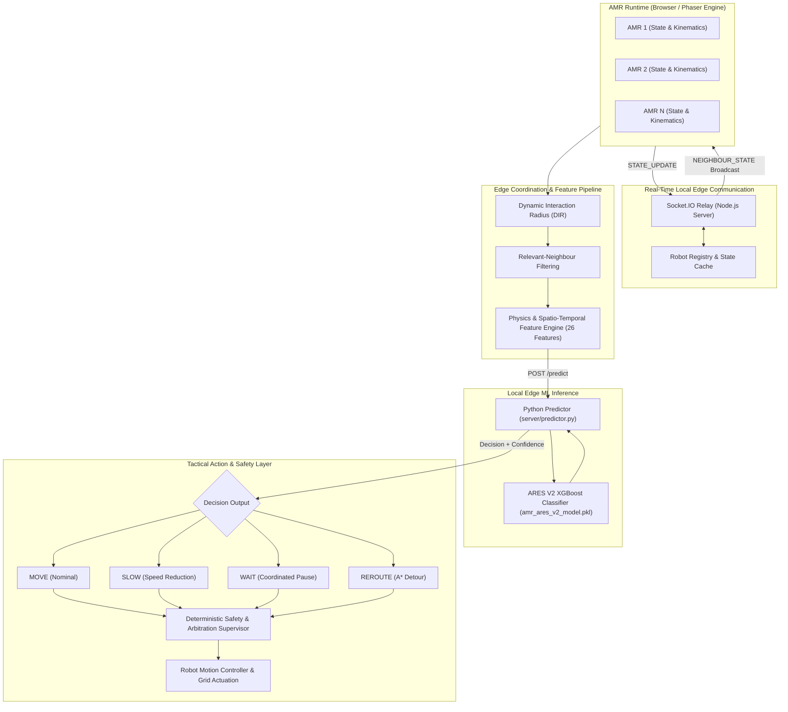

# ARES — Autonomous Robot Edge Coordination System

**ARES** is an Edge-AI multi-agent coordination system engineered for Autonomous Mobile Robots (AMRs) operating in dynamic, high-density warehouse environments. By combining local edge-coordinated communication, a dynamic interaction radius, spatio-temporal conflict analysis, and an optimized 26-feature XGBoost decision model, ARES resolves multi-robot crossing, opposite-direction, and bottleneck congestion in real time through coordinated tactical actions (`MOVE`, `SLOW`, `WAIT`, `REROUTE`) backed by a deterministic safety intervention supervisor.

---

## Overview

### The Multi-AMR Warehouse Coordination Problem
Modern automated warehouses rely on fleets of autonomous mobile robots transporting goods across shared aisles and intersections. When navigation relies purely on independent shortest-path algorithms (such as static or uncoordinated A*), robots plan routes without awareness of other robots' future trajectories. This uncoordinated behavior creates:
- **Head-on deadlocks** in narrow two-way corridors.
- **Intersection collisions and gridlock** when multiple robots arrive at conflict zones simultaneously.
- **Stop-and-go congestion waves** that reduce overall fleet throughput and degrade battery efficiency.

### The ARES Approach
ARES introduces an Edge-AI coordination paradigm that bridges decentralized autonomy with real-time peer awareness:
- **Local Edge-Coordinated Communication:** Robots continuously publish their operational state to a lightweight local edge coordinator.
- **Dynamic Interaction Radius (DIR):** Each robot dynamically sizes its sensing perimeter according to its velocity and local traffic density.
- **Relevant-Neighbour Filtering:** The system isolates only peer robots that represent potential spatio-temporal conflicts, eliminating prohibitive $O(N^2)$ global calculations.
- **Physics-Informed ML Inference:** Preprocessed kinematic and trajectory metrics are fed into an ultra-fast XGBoost classifier deployed at the edge.
- **Hybrid Safety Supervisor:** Discrete tactical ML decisions are validated and bounded by deterministic kinematic and spatial safety rules before actuation.

---

## Key Capabilities

- **Multi-Robot Fleet Coordination:** Simultaneous real-time coordination across active AMRs in a 2D warehouse grid.
- **Dynamic Interaction Radius (DIR):** Adaptive spatial interaction threshold scaled by velocity and local cluster density.
- **Relevant-Neighbour Filtering:** Proximity and heading filtering that isolates genuine conflict candidates.
- **Physics & Spatio-Temporal Feature Engine:** 26 raw features capturing kinematics, geometry, Closest Point of Approach (CPA), and Time-to-Collision (TTC).
- **XGBoost Decision Engine:** High-performance 4-class classifier producing tactical actions (`MOVE`, `SLOW`, `WAIT`, `REROUTE`).
- **A\* Path Planning:** 8-directional warehouse pathfinding with static obstacle avoidance and dynamic conflict detour capabilities.
- **Real-Time Socket.IO Communication:** Low-latency bidirectional state synchronization and peer broadcast via a local edge relay.
- **Deterministic Safety Layer:** Hard safety guarantees including separation buffers, deadlock resolution, mutual wait release, and priority arbitration.
- **Sub-Millisecond Edge Inference:** Local Python predictor delivering ~0.64 ms mean inference latency.
- **Dual Run Modes (Baseline vs. ARES):** Side-by-side comparative simulation toggling between raw independent navigation and ARES Edge-AI coordination.
- **Structured Observability:** Centralized, throttled runtime logger with granular categorization across network, feature generation, ML inference, and safety interventions.

---

## System Architecture



> **Note on Network Architecture:** The current prototype implements **real-time local edge communication** (a local Edge Coordinator relay over Socket.IO) rather than direct robot-to-robot peer-to-peer (P2P) networking. Direct P2P networking is not part of this prototype.

---

## ML Decision Engine

ARES V2 employs a fine-tuned **XGBoost (Extreme Gradient Boosting)** multiclass classifier trained to identify conflict types and output optimal tactical responses.

### Target Classes (4 Output Actions)
| Action | Class Index | Tactical Purpose |
| :--- | :---: | :--- |
| **`MOVE`** | 0 | Nominal cruising speed along the planned path. |
| **`SLOW`** | 1 | Velocity reduction to allow crossing or preceding vehicles to clear. |
| **`WAIT`** | 2 | Temporary halt with deadlock monitoring and auto-release logic. |
| **`REROUTE`** | 3 | Dynamic triggering of alternate A\* path planning around conflict zones. |

### Feature Contract (26 Input Features)
The feature extraction pipeline produces exactly 26 features (22 numerical, 4 categorical):

| Group | Features | Type | Description |
| :--- | :--- | :---: | :--- |
| **Ego Kinematics** | `current_x`, `current_y`, `speed_mps`, `heading_rad` | Numerical | Current world coordinates, linear speed, and orientation. |
| **Target & Navigation** | `destination_x`, `destination_y`, `distance_to_destination_m`, `eta_sec` | Numerical | Goal coordinates, remaining Euclidean distance, and estimated time of arrival. |
| **System State** | `battery_pct` | Numerical | State of charge (0–100%). |
| **Corridor State** | `obstacle_detected`, `path_blocked`, `alternative_route_available` | Numerical | Binary indicators for sensory obstacles, grid blockages, and bypass paths. |
| **Spatial Envelope** | `dynamic_interaction_radius_m` | Numerical | Dynamically computed interaction perimeter in meters. |
| **Neighbour Proximity** | `nearby_robot_count`, `nearest_robot_distance_m` | Numerical | Density of peers inside DIR and distance to nearest peer. |
| **Relative Kinematics** | `nearest_robot_relative_speed_mps`, `nearest_robot_relative_heading_rad`, `closing_velocity_mps` | Numerical | Differential speed, angle between velocity vectors, and approach rate. |
| **Conflict Geometry** | `true_ttc_sec`, `cpa_time_sec`, `cpa_distance_m`, `intersection_conflict` | Numerical | Exact time to collision, time/distance to closest point of approach, and path crossing flag. |
| **Categorical Meta** | `task_type` | Categorical | Operational mission (`PICK`, `DROP`, `CHARGE`, `RELOCATE`). |
| | `task_priority` | Categorical | Priority rank (`LOW`, `MEDIUM`, `HIGH`, `CRITICAL`). |
| | `traffic_level` | Categorical | Surrounding corridor load (`LOW`, `MEDIUM`, `HIGH`, `CRITICAL`). |
| | `relative_direction` | Categorical | Relative heading geometry (`SAME`, `OPPOSITE`, `CROSSING`, `NONE`). |

---

## Model Evaluation

The deployed V2 model (`ml/amr_ares_v2_model.pkl`) was evaluated against an independent stratified test partition from the simulation conflict dataset:

### Classification Performance
- **Overall Accuracy:** 91.74%
- **Macro F1-Score:** 0.8240
- **Weighted F1-Score:** 0.9203

### Per-Class F1 Performance
| Action Class | F1-Score | Performance Characteristic |
| :--- | :---: | :--- |
| **`MOVE`** | **0.9711** | Exceptional precision during free-flow cruising. |
| **`SLOW`** | **0.7972** | Reliable early speed mitigation in crossing encounters. |
| **`WAIT`** | **0.8162** | High-precision stopping when collision risk exceeds thresholds. |
| **`REROUTE`** | **0.7114** | Selective rerouting triggered only when alternate paths are viable. |

### Edge Hardware Benchmark
- **Mean Inference Latency:** ~0.637 ms
- **95th Percentile (p95) Latency:** ~1.088 ms
- **Model Artifact Size:** ~1.18 MB (optimized for constrained edge memory)

> **Evaluation Context:** These metrics are derived from the developed simulation dataset and offline validation test suite. They represent benchmarked performance in modeled scenarios, not absolute claims of universal real-world warehouse throughput.

---

## Communication Architecture

Robot telemetry and neighbour exchange are powered by a persistent **Socket.IO** local edge server:

```
AMR Client (socketClient.js)  <─── WebSocket / Polling ───>  Local Edge Coordinator (server/index.js)
```

1. **Persistent Connection & Registration:** Each AMR establishes a Socket.IO connection and transmits a `REGISTER` event with its unique identifier.
2. **Periodic State Updates (`STATE_UPDATE`):** Active robots stream validated state payloads:
   - Identifiers: `robotId`, `task`, `priority`, `status`
   - Coordinates & Motion: `x`, `y`, `speed`, `heading`, `destination`
   - Health: `battery`, `timestamp`
3. **Neighbour Broadcast (`NEIGHBOUR_STATE`):** The edge server validates the incoming payload, updates its internal registry, and immediately broadcasts the peer state to all other connected AMRs.
4. **Heartbeats & Disconnect Handling:** The edge coordinator tracks client liveness. If a connection drops, a `ROBOT_DISCONNECTED` event is broadcast to clear stale neighbor entries.
5. **Stale State Eviction:** Client-side caches automatically evict robot states older than `STALE_TIMEOUT_MS` (10 seconds).

> **Architectural Note:** The current prototype uses a **local Edge Coordinator relay architecture** rather than direct robot-to-robot P2P networking.

---

## Dynamic Interaction Radius (DIR)

Rather than treating every robot in the facility as a relevant agent, ARES computes a localized **Dynamic Interaction Radius** ($R$) for each AMR:

$$R = \text{clip}(R_{\text{base}} + v \times \tau + \beta \times \rho,\; R_{\text{min}},\; R_{\text{max}})$$

### Configuration Parameters
- **Base Radius ($R_{\text{base}} = R_{\text{min}}$):** 5.0 meters
- **Maximum Radius ($R_{\text{max}}$):** 20.0 meters
- **Reaction Time ($\tau$):** 1.5 seconds
- **Density Coefficient ($\beta$):** 1.0
- **Density Sampling Radius:** 8.0 meters ($\rho$ is the number of peers within 8 m)

### Why Relevant-Neighbour Filtering Matters
In a warehouse with dozens of AMRs, all-to-all collision checking scales as $\mathcal{O}(N^2)$, saturating local networks and CPU cycles. By applying DIR and trajectory alignment filtering, each robot only extracts features and evaluates risks against agents that physically threaten its forward path.

---

## Decision Flow

```
1. Robot publishes operational state to local Edge Coordinator via Socket.IO
                           ↓
2. Edge Coordinator validates and relays state as NEIGHBOUR_STATE
                           ↓
3. Robot isolates relevant neighbours within its Dynamic Interaction Radius
                           ↓
4. Physics, kinematics, and spatio-temporal conflict features are calculated
                           ↓
5. Feature vector (26 features) sent to local predictor (POST /predict)
                           ↓
6. Edge XGBoost model infers optimal action: MOVE, SLOW, WAIT, or REROUTE
                           ↓
7. Deterministic Safety Layer validates, arbitrates, or constrains the action
                           ↓
8. Movement controller actuates robot position along grid path
```

---

## Actions

The ML model outputs discrete tactical intentions. It does not directly command raw wheel motor voltages:

- **`MOVE` (Nominal Movement):** Cruising speed along the planned path when no imminent conflict is detected.
- **`SLOW` (Speed Reduction):** Decelerates robot velocity (e.g., 50% speed) to yield right-of-way smoothly without coming to a complete standstill.
- **`WAIT` (Coordinated Stop):** Temporarily halts at the current waypoint. Enters a supervised wait state with deadlock detection and timeout release.
- **`REROUTE` (Alternate Path Planning):** Queries the A\* grid navigation module to calculate a detour avoiding congested segments. If no alternate path exists, the system gracefully falls back to `WAIT`.

---

## Safety Layer

While the XGBoost model delivers high-accuracy tactical suggestions, **deterministic safety supervisors guarantee collision-free operation**.

- **Separation Verification:** Hard spatial bounding boxes enforce minimal physical clearances between AMR frames.
- **Priority-Aware Arbitration:** When two robots encounter a mutual wait or intersection deadlock, tie-breaking rules arbitrate based on task priority (`CRITICAL` > `HIGH` > `MEDIUM` > `LOW`) or unique robot ID.
- **Deadlock Detection & Wait Release:** Robots paused in `WAIT` monitor leading peer movement. When a leading robot clears the downstream tile, the waiting robot automatically releases without human intervention.
- **Confidence & Staleness Fallback:** If ML confidence drops below 50% ($0.50$) or if feature telemetry is stale (>3000 ms), the controller falls back to safe deterministic cruising or precautionary stops.

*Machine learning informs tactical decisions; deterministic safety algorithms guarantee physical bounds.*

---

## Simulation Prototype

The ARES prototype is implemented as a high-fidelity 2D web simulation built with **Phaser.js 3** and **Tiled**:
- **Warehouse Map:** Discrete 32×32 pixel tile grid representing logistics staging areas, storage racks, charging pads, and transit corridors.
- **Concurrent AMRs:** Dynamic sprite entities navigating paths calculated via 8-directional A\* pathfinding.
- **Visual Debugging:** Live rendering of waypoints, dynamic interaction radii, heading vectors, and conflict bounding boxes.
- **Scenario Management:** Pre-configured multi-robot conflict scenarios (head-on, crossing, bottleneck, multi-robot convergence).

> *Distinction:* This simulation demonstrates software coordination algorithms, edge messaging, and ML inference. It does not replace physical hardware-in-the-loop (HIL) validation.

---

## Technology Stack

| Component | Technology | Role |
| :--- | :--- | :--- |
| **Frontend / Simulation** | Phaser.js 3, JavaScript (ES Modules), Vite | 2D warehouse canvas, sprite rendering, physics loop |
| **Map & Assets** | Tiled, TMJ (`warehousemap.tmj`), TSX | Warehouse layout, collision layers, walkable corridors |
| **Backend / Edge Relay** | Node.js, HTTP, Socket.IO | Local Edge Coordinator, state registry, client broadcast |
| **ML Inference Service** | Python 3, Flask/HTTP stream, `predictor.py` | Local sub-millisecond model execution |
| **Machine Learning** | XGBoost, scikit-learn, joblib, pandas, numpy | Feature encoding, preprocessing, decision classification |
| **Navigation** | Custom 8-Directional A\* | Grid path planning with dynamic obstacle avoidance |
| **Logging & Telemetry** | Centralized structured JS logger | Granular, throttled event tracking |

---

## Project Structure

```
Simulation/
├── index.html                      # Single-page simulation dashboard UI
├── package.json                    # Node.js project manifest & scripts
├── package-lock.json               # Locked dependency tree
├── vite.config.js                  # Vite bundler configuration
├── README.md                       # Complete technical documentation
├── map/                            # Warehouse map specifications and tilesets
│   ├── warehousemap.tmj            # Canonical Tiled JSON map definition
│   ├── warehousemap.tmx            # Tiled XML source map
│   ├── images/                     # Sprite sheets, floor tiles, and AMR textures
│   └── tilesets/                   # Tiled TSX definition files
├── ml/                             # Deployed ARES V2 Machine Learning artifacts
│   ├── amr_ares_v2_config.pkl      # Feature contract and class mappings
│   ├── amr_ares_v2_model.pkl       # Trained 4-class XGBoost model (~1.18 MB)
│   └── amr_ares_v2_preprocessor.pkl# Column transformer and scaler pipeline
├── server/                         # Local Edge Coordinator & ML predictor
│   ├── index.js                    # Node.js HTTP + Socket.IO Edge Server
│   └── predictor.py                # Persistent Python stdin/stdout predictor
└── src/                            # Core simulation and coordination source
    ├── main.js                     # Phaser scene initialization and life-cycle
    ├── config/
    │   └── constants.js            # Grid dimensions, speeds, and simulation constants
    ├── coordination/
    │   ├── adaptiveIntervention.js # Deadlock resolution, wait-release, and arbitration
    │   ├── conflictDetection.js    # Geometric CPA, TTC, and intersection detection
    │   ├── mlFeatureBuilder.js     # Unified feature builder re-export proxy
    │   └── relevantNeighbours.js   # Relevant-neighbour filtering re-export proxy
    ├── lib/
    │   └── supabaseClient.js       # Cloud scenario storage integration client
    ├── map/
    │   └── warehouseLoader.js      # Map layer parsing and collision grid generation
    ├── navigation/
    │   ├── astar.js                # 8-directional A* grid path planning
    │   ├── navGrid.js              # Walkability queries and dynamic obstacle cost
    │   └── pathVisualizer.js       # Canvas path and conflict marker rendering
    ├── network/
    │   ├── edgeClient.js           # ML HTTP client and 26-feature builder engine
    │   └── socketClient.js         # Socket.IO client, DIR, and peer state tracking
    ├── robots/
    │   ├── robotDrag.js            # Interactive mouse dragging and waypoint updates
    │   ├── robotManager.js         # AMR entity lifecycle, spawning, and state sync
    │   └── robotMovement.js        # Motion loop, decision execution, and safety layer
    ├── scenarios/                  # Scenario management and definitions
    │   ├── baseScenarioRepository.js
    │   ├── scenarioModel.js
    │   ├── scenarioRepository.js
    │   ├── scenarioService.js
    │   └── supabaseScenarioRepository.js
    ├── simulation/                 # Simulation metrics and benchmarking
    │   ├── benchmarkHarness.js     # Automated scenario runner and metric collector
    │   ├── runMetrics.js           # Distance, time, and collision metric tracking
    │   └── runSession.js           # Session lifecycle management
    ├── ui/                         # User interface components and styles
    │   ├── comparisonPanel.js      # Baseline vs ARES visual comparison panel
    │   ├── dashboard.css           # Glassmorphism styling and responsive layout
    │   ├── dashboardControls.js    # Simulation controls (play, pause, speed, mode)
    │   ├── mapControls.js          # Zoom, pan, and layer visibility toggles
    │   ├── robotControls.js        # Robot inspector and telemetry status panels
    │   └── scenarioManager.js      # Scenario selector modal and controls
    └── utils/
        └── logger.js               # Centralized structured runtime logger
```

---

## Installation & Setup

### Prerequisites
- **Node.js:** v18.0.0 or higher
- **npm:** v9.0.0 or higher
- **Python:** v3.9 or higher (with `pip`)

### 1. Install Node.js Dependencies
```bash
npm install
```

### 2. Install Python ML Dependencies
```bash
pip install xgboost scikit-learn joblib pandas numpy
```

### 3. Run the Local Edge Coordinator Server
In your first terminal, launch the local Edge Coordinator server (runs on `http://127.0.0.1:3001` and automatically spawns the persistent Python predictor):
```bash
npm run server
```

### 4. Run the Frontend Simulation
In a second terminal, start the Vite development server:
```bash
npm run dev
```
Open your browser and navigate to `http://localhost:5173`.

### 5. Production Build Verification
To compile the client application into a production bundle:
```bash
npm run build
```

---

## Runtime Architecture

```
Frontend Client (Phaser 3) ──[HTTP POST /predict]──> Local Server (server/index.js)
                                                           │
                                                      (stdin/stdout)
                                                           │
                                                           ▼
                                               Python Engine (predictor.py)
```

- **Local Inference Endpoint:** `http://127.0.0.1:3001/predict`
- **Request Format:**
  ```json
  {
    "robotId": "AMR_01",
    "features": {
      "current_x": 12.5,
      "current_y": 8.0,
      "speed_mps": 1.2,
      "closing_velocity_mps": 2.1,
      "true_ttc_sec": 3.4,
      ...
    }
  }
  ```
- **Response Format:**
  ```json
  {
    "robotId": "AMR_01",
    "decision": "SLOW",
    "confidence": 0.8842
  }
  ```

---

## Baseline vs. ARES Mode

The user interface provides a toggle between two operational paradigms:

| Dimension | BASELINE Mode | ARES Coordinated Mode |
| :--- | :--- | :--- |
| **Coordination** | None (Independent navigation) | Active Edge-AI multi-robot coordination |
| **Peer Awareness** | Blind to other robots | Dynamic Interaction Radius + Relevant Neighbours |
| **Intervention** | None (Robots maintain planned course) | Coordinated `MOVE`, `SLOW`, `WAIT`, `REROUTE` |
| **Safety Logic** | Basic stop on physical contact | Predictive spatio-temporal safety supervisor |
| **Conflict Behavior** | Susceptible to head-on deadlocks and crashes | Proactive yielding, speed reduction, and detours |

---

## Benchmark Results

The coordination architecture was evaluated against a standard 5-scenario benchmark suite (Head-On Corridor, Perpendicular Crossing, 4-Way Intersection, Bottleneck Convergence, Fleet Aisle Congestion):

### Summary Across 5 Benchmark Scenarios
| Metric | BASELINE | ARES | Impact |
| :--- | :---: | :---: | :--- |
| **Collision Events** | **15** | **0** | **100% collision elimination** |
| **Near-Collision Events** | **19** | **0** | **100% near-miss elimination** |
| **Deadlock Occurrences** | Frequent | Resolved | Auto-release & arbitration |

### Trade-Offs & Honest Limitations
While ARES eliminated all collisions and near-misses in the benchmark:
- **Completion Time:** ARES scenarios exhibited higher mission completion times due to proactive deceleration (`SLOW`) and coordinated halts (`WAIT`).
- **Transit Distance:** Rerouting behaviors (`REROUTE`) increased total travel distance in congested scenarios.
- **Energy Footprint:** Controlled waiting avoids physical collisions but does not universally decrease total journey energy.

> **Transparency Note:** ARES prioritizes fleet safety, physical separation, and deadlock elimination over reckless transit speed. It does **not** claim to be universally faster in every operational topology.

---

## Logging & Observability

A centralized, non-intrusive logger (`src/utils/logger.js`) provides structured runtime telemetry with built-in deduplication and throttling to prevent console flooding:

| Category Tag | Telemetry Description |
| :--- | :--- |
| **`[SOCKET]`** | Connection events, state broadcast, disconnect notices. |
| **`[DIR]`** | Real-time Dynamic Interaction Radius calculations and local density. |
| **`[NEIGHBOUR]`** | Relevant-neighbour identification and filtering events. |
| **`[FEATURE]`** | Spatio-temporal metrics summary (TTC, CPA, closing velocity). |
| **`[ML]`** | Inferred decision, confidence score, and inference latency. |
| **`[ACTION]`** | Motion controller action state transitions. |
| **`[SAFETY]`** | Separation alerts, mutual wait pauses, and auto-releases. |
| **`[FALLBACK]`** | Rule-based fallback invocations for stale or low-confidence data. |
| **`[ERROR]`** | Network failures or runtime validation rejections. |

*To toggle verbose logging in the browser console:*
```javascript
window.setDebugLogs(true);  // Enable verbose debugging
window.setDebugLogs(false); // Enable quiet operational mode
```

---

## Validation & Test Suite

The system has undergone systematic phased testing across unit, integration, and stress benchmarks:

- **Stage 5D (Network & ML Integration):** 62/62 test cases passed.
- **Stage 5E (Distributed Multi-Robot Coordination):** 255/255 test cases passed.
- **Stage 3C (Conflict Detection Suite):** 12/12 test cases passed.
- **Same-Direction Wait Release:** 16/16 test cases passed.
- **Production Bundle Compilation:** Clean Vite build (`dist/`) with zero linting or bundling errors.

---

## Real-World Deployment Path

```
Onboard Sensors & Wheel Encoders
              ↓
Local Edge Gateway (Wi-Fi 6 / 5G Private Network)
              ↓
Relevant-Neighbour Filtering & DIR Calculation
              ↓
Physics & Spatio-Temporal Feature Engine
              ↓
Edge XGBoost Predictor (~0.64 ms inference)
              ↓
Deterministic Safety Arbitration Supervisor
              ↓
AMR Motor Controllers & Navigation Stack (e.g. ROS 2 Nav2)
```

In a physical facility, the ARES coordination stack functions as an edge-tier tactical planner positioned between high-level Fleet Management Systems (FMS) and low-level onboard navigation controllers (e.g., ROS 2 / Nav2).

---

## Limitations

- **2D Discrete Simulation:** The current prototype operates on a 2D tile grid and does not simulate non-planar dynamics, floor friction variability, or wheel slippage.
- **Relay-Based Network:** Edge coordination relies on a local relay coordinator rather than ad-hoc mesh P2P networking.
- **Evaluation Dataset:** Machine learning performance reflects the synthetic and simulated scenarios used for training and testing.
- **Actuation Boundary:** Real-world deployment requires integration with physical LiDAR, sensor fusion pipelines, and continuous motor controllers.

---

## Future Scope

- **ROS 2 / Gazebo Integration:** Packaging ARES as a standard ROS 2 node compatible with Nav2.
- **Continuous 3D Physics Simulation:** Hardware-in-the-loop (HIL) validation with high-fidelity physics engines.
- **Decentralized P2P Mesh:** Evaluating ad-hoc Wi-Fi mesh protocols for peer-to-peer state sharing without edge relays.
- **Reinforcement Learning Hybridization:** Enhancing static rerouting with learned trajectory generation.
- **Large-Scale Fleet Testing:** Validating scaling behavior on fleets exceeding 50+ concurrent robots.

---

## Project Information

- **Project:** ARES — Autonomous Robot Edge Coordination System
- **Initiative:** Smart India Hackathon (SIH)
- **Problem Statement:** SIH26123
- **Repository:** Autonomous Robot Edge Coordination System
